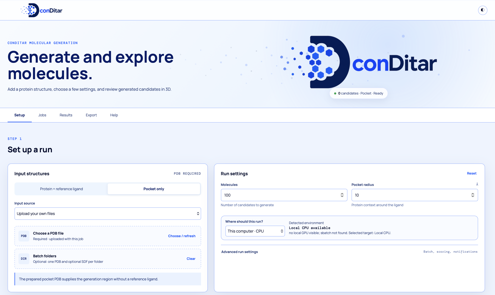

# conDitar GUI

A lightweight browser GUI for running conDitar molecular generation jobs.

This folder contains the conDitar browser GUI. It stages user-selected PDB/SDF
inputs, launches conDitar jobs through the container image built from
`conDitar-dev`, tracks job status, and reads generated SDF outputs.

The generator, container, and GUI are documented separately:

- [`../README.md`](../README.md) — model, sampling, and repository overview.
- [`../docker/conditar_dev/README.md`](../docker/conditar_dev/README.md) — image build, Docker/Podman
  usage, and container-only runs.



## Architecture overview

```text
conDitar-dev/gui
  Browser GUI + Python backend
  Starts jobs, tracks logs/status, reads generated SDF outputs

conDitar-dev container/source
  Docker/Podman image with conDitar code, dependencies, model files, and runtime entry point
  Default image name: conditar-dev:standalone-20261001

DiffSMol container
  Standalone shape generation and selected chemistry/docking evaluations
  Build instructions: ../docker/diffsmol/README.md
```

Typical local CPU flow:

1. Pull the `conDitar-dev` runtime image.
2. Run `./setup_gui.sh` to check Python, Docker, the image, and optional tools.
3. Start this GUI folder with `./start_cpu_gui.sh`.
4. Open the local URL printed by the launcher.
5. Choose inputs, settings, and target, then click **Generate molecules**.

Job folders are written under `job_data/jobs/<job-id>/`. That directory is
ignored by git and contains staged inputs, logs, metadata, generated SDFs, and
export ZIPs.

Set `CONDITAR_JOB_ROOT=/path/to/jobs` to store job folders outside the GUI
source tree. This is useful for container deployments where job data should live
on a mounted persistent volume.

DiffSMol additionally needs its own container image. After loading or building
that image, set `DIFFSMOL_DOCKER_IMAGE` in the ignored `.conditar-cpu.env` file.
`./setup_gui.sh` reports its availability without blocking conDitar-only use.
The Setup checklist checks the image for the currently selected engine.
DiffSMol generation and selected post-processing run in one invocation of that
image on local CPU, Slurm GPU, or OpenShift. The GUI waits for both stages to
finish before exposing results. Slurm can load a separate DiffSMol archive with
`DIFFSMOL_DOCKER_TAR`; otherwise preload/pull the image on compute nodes.
The refreshed standalone conDitar image is `conditar-dev:standalone-20261001`
locally. Build it with the command in `../docker/conditar_dev/README.md`, or set
`CONDITAR_DOCKER_IMAGE` to a registry copy. The GUI no longer injects conDitar
scripts from its checkout; generation and selected evaluations finish in the
same conDitar container on local CPU, Slurm GPU, or OpenShift.

## Quick start

For first-time local CPU setup with Docker or Docker Desktop:

```bash
docker pull osuninglab/conditar-dev:2026-07-10
git clone https://github.com/ninglab/conDitar-dev.git
cd conDitar-dev
docker build --platform linux/amd64 -f docker/conditar_dev/Refresh.Dockerfile \
  -t conditar-dev:standalone-20261001 scripts
cd gui
./setup_gui.sh
./start_cpu_gui.sh
```

The launcher normally opens `http://127.0.0.1:4173`. If that port is busy, it
automatically tries the next available port and prints the URL to use.

After this first setup check succeeds, future local CPU sessions usually only
need:

```bash
./start_cpu_gui.sh
```

For OpenShift-hosted deployment, use the dedicated instructions in
[`openshift/SITE_QUICKSTART.md`](openshift/SITE_QUICKSTART.md).

## Local CPU startup

Requirements:

- Git
- Python 3.9 or newer
- Docker Desktop
- The refreshed conDitar image `conditar-dev:standalone-20261001`

Linux, macOS, and Windows through WSL2 are supported for local GUI use. On
Windows, run the shell scripts from WSL2, not native PowerShell. Install Docker
Desktop, enable its WSL2 integration, and leave Docker Desktop running while
you use the GUI. On macOS, you can also double-click `START_HERE_MAC.command`
from Finder after Docker Desktop is installed and running.

### Windows CPU setup

1. Install Docker Desktop and WSL2.
2. In Docker Desktop, open **Settings > Resources > WSL Integration** and turn
   on integration for the WSL distribution you will use.
3. Install Miniconda or Miniforge inside WSL, then open a fresh WSL terminal.
4. Clone the repository inside WSL or put the repository somewhere WSL can read,
   such as your WSL home directory.
5. Run the same local CPU commands:

   ```bash
   docker pull osuninglab/conditar-dev:2026-07-10
   git clone https://github.com/ninglab/conDitar-dev.git
   cd conDitar-dev
   docker build --platform linux/amd64 -f docker/conditar_dev/Refresh.Dockerfile \
     -t conditar-dev:standalone-20261001 scripts
   cd gui
   ./setup_gui.sh
   ./start_cpu_gui.sh
   ```

The Setup page includes a **Launch checklist** that reports whether Python,
Docker/Podman, the conDitar image, Slurm, and optional Tool Chest tools are
available. If Docker commands fail inside WSL, first confirm Docker Desktop is
open and WSL integration is enabled for that distribution.

If port `4173` is already in use, the launchers automatically try the next
available port and print the URL they selected. Use the printed URL in your
browser. To request a specific starting port:

```bash
PORT=4174 ./start_cpu_gui.sh
```

On Windows/WSL, seeing "port already in use" usually means another conDitar GUI
terminal or browser session is still running. You can use that existing window,
close the old terminal, or rerun the launcher and follow the newly printed URL.

## Slurm GPU startup

Fresh Slurm/GPU setup:

1. Clone the `gui-dev` branch onto the cluster and enter `gui/`.
2. Run setup with an absolute directory on storage visible from both login and
   compute nodes, then start the GUI:

   ```bash
   ./setup_slurm_gui.sh --shared-dir /shared/path/conditar-gui --account YOUR_ACCOUNT
   ./start_slurm_gui.sh
   ```

   Setup pulls the published conDitar and DiffSMol images with Podman, saves
   both archives under `images/`, creates `jobs/`, and writes the configuration
   to the ignored `.conditar-slurm.env` file. Rerunning setup refreshes both
   archives. Never use node-local `/tmp` for these paths. The script can prompt
   for the directory and account when run interactively without arguments.
3. Verify the shared directory is visible from a compute node. Open the printed
   GUI URL, choose **Slurm GPU · Podman**, and check Launch readiness before
   submitting. If your cluster requires a GPU partition, set
   `CONDITAR_SLURM_PARTITION` in `.conditar-slurm.env`.

For full preprocessing and Tool Chest support, run `./setup_tool_chest.sh` once
if Conda and build tools are available on the login host. The GUI runs Python
on that host; the generator jobs run in Podman on compute nodes.

The launcher normally opens `http://127.0.0.1:4173`; if that port is busy, it
prints the next available local URL. Forward that port from your workstation
if the GUI is running on a remote login node. It validates the archives and
required commands before starting.
Each submitted GPU batch is sent to Slurm as an array job; scheduler delays or
account/GPU limits are reported in the Jobs panel with the scheduler reason.

## OpenShift deployment

From an OpenShift Web Terminal in the intended project, clone this branch,
enter `gui/`, and run `./openshift/deploy.sh`. The default uses three pinned
prebuilt images and submits real CPU OpenShift Jobs; no local Python, Docker,
or image build is required. The script prints the GUI Route.

OpenShift Job is the run target; CPU or GPU is the resource requested by that
Job. GPU settings require quota and validation in the destination project.
See [`openshift/SITE_QUICKSTART.md`](openshift/SITE_QUICKSTART.md) for the
partner procedure, [`openshift/README.md`](openshift/README.md) for deployment
options, and [`openshift/VALIDATION_PROTOCOL.md`](openshift/VALIDATION_PROTOCOL.md)
for acceptance checks.

## Slurm GPU operation

After Slurm/GPU setup is configured, future GPU sessions usually only need:

```bash
./start_slurm_gui.sh
```

Requirements:

- A cluster session with Slurm available
- Podman available on the login or compute environment
- The refreshed conDitar image available on compute nodes, or a shared image
  archive that can be loaded by the Slurm job
- Any site-specific setup required for remote desktop or web access

The Slurm setup script records these settings in `.conditar-slurm.env`:

```bash
CONDITAR_RUNTIME=podman
CONDITAR_DOCKER_IMAGE=docker.io/osuninglab/conditar-dev:gui-dev-20261005
DIFFSMOL_DOCKER_IMAGE=docker.io/osuninglab/diffsmol:gui-dev-20261005
CONDITAR_DOCKER_TAR=/shared/path/conditar-gui/images/conditar.tar
DIFFSMOL_DOCKER_TAR=/shared/path/conditar-gui/images/diffsmol.tar
CONDITAR_JOB_ROOT=/shared/path/conditar-gui/jobs
CONDITAR_SLURM_ACCOUNT=YOUR_ACCOUNT
CONDITAR_SLURM_TIME=04:00:00
CONDITAR_SLURM_MEM=32G
CONDITAR_SLURM_CPUS=4
CONDITAR_SLURM_GPUS=1
```

Override any default inline when needed:

```bash
CONDITAR_SLURM_PARTITION=nextgen \
CONDITAR_SLURM_TIME=08:00:00 \
./start_slurm_gui.sh
```

In the GUI, enter your required Slurm account and choose
**Slurm GPU · Podman** under **Where should this run?** before submitting. The
backend writes `run.slurm`, submits with `sbatch`, and polls Slurm/log files
until outputs are ready.

## Runtime options

The GUI chooses the container runner from environment variables:

- `CONDITAR_RUNTIME=docker` for local Docker Desktop.
- `CONDITAR_RUNTIME=podman` for Linux/cluster Podman.
- `CONDITAR_RUNTIME=auto` to select an available local Docker/Podman runtime.

For local CPU defaults that should not be committed, put environment assignments
in `.conditar-cpu.env`; `start_cpu_gui.sh` loads it automatically.

Use a different image name:

```bash
CONDITAR_DOCKER_IMAGE=my-registry/conditar-dev:tag \
CONDITAR_RUNTIME=docker \
./start_cpu_gui.sh
```

Use a local `conDitar-dev` checkout while keeping the same container
environment/checkpoints:

```bash
CONDITAR_SOURCE_MOUNT=/path/to/conDitar-dev \
CONDITAR_RUNTIME=docker \
./start_cpu_gui.sh
```

This is useful for source-only conDitar edits. Rebuild the container when
dependencies, model/checkpoint files, or container setup changes. The launchers
do not mount source by default; this override is only for intentional
development runs.

If Docker or Podman is installed in a nonstandard location:

```bash
DOCKER_BIN=/path/to/docker ./start_cpu_gui.sh
PODMAN_BIN=/path/to/podman ./start_slurm_gui.sh
```

Local NVIDIA GPU execution requires Docker Desktop GPU support and a compatible
NVIDIA runtime. For normal GPU throughput, use the Slurm/Podman path.

## Using the GUI

1. Choose **Protein + reference ligand** or **Pocket only**.
2. Upload a PDB file; reference mode also requires an SDF ligand.
3. Set **Molecules**, **Batch size**, and **Pocket radius**.
4. Choose **This computer · CPU** or **Slurm GPU · Podman**.
5. Enable Vina scoring if desired, then review Slurm options when using the GPU target.
6. Click **Generate molecules**.
7. Use the **Jobs** tab to monitor status and load completed outputs.
8. Use the **Results** and **Export** tabs to inspect molecules, filter
   candidates, and download SDF/CSV/ZIP artifacts.

CPU email notifications are intentionally disabled in the GUI until a local
SMTP/sendmail path is configured. Slurm GPU jobs can use scheduler email notifications
when an email address is provided.

Filtered exports are saved both by the browser and, for completed backend jobs,
under the job folder at `job_data/jobs/<job-id>/filtered_exports/`. Each
filtered export includes copied SDFs, `metrics.csv`, and `export_metadata.json`
with the active thresholds and tool runs used for that subset.

A job becomes completed after generation and its selected evaluators finish.
Results treat each generated molecule as one candidate. Multi-record SDF outputs
are split into individual files under `outputs/`; the unmodified source is kept
under `raw_outputs/` and listed as an artifact. The input reference SDF is not
counted or evaluated as a generated candidate. Formula and molecular weight are
calculated with RDKit by the GUI backend.

If a Slurm job is `PENDING`, the scheduler has accepted it but is waiting for account,
partition, or GPU capacity. If it fails before producing container output,
inspect `logs/sbatch.stderr.log` and `logs/stderr.log`; a missing image archive
or unavailable image indicates that the GPU launcher was not used, the image
was not pulled, or the archive path is incorrect.

## Batch folders

The GUI can accept folders of paired inputs.

- Local CPU batches become one job per folder in a serial local worker queue.
- Slurm GPU batches submit one Slurm array with one task per folder, allowing
  Slurm to run them in parallel subject to account, partition, and GPU
  availability.

The browser never passes arbitrary client filesystem paths into the container.
Uploaded files are copied into each job's private `inputs/` directory first.

## Tool Chest

Completed jobs can be annotated with optional molecule-evaluation tools from the
Results tab. Tool runs write logs and summaries under
`job_data/jobs/<job-id>/tool_runs/` and can add new SDF properties that appear
in the table, selected-molecule details, and CSV export.

Tool Chest evaluators can also be selected before submission from
**Advanced run settings** under **Evaluate molecules**. Those evaluators run on
the GUI backend after conDitar generation completes, without rebuilding the
conDitar sampling image.

Included tools currently cover Lilly Medchem Rules plus the medchem tutorial
filter set: Ro5, Ghose, Veber, ZINC, BMS alerts, PAINS alerts, SureChEMBL
alerts, NIBR, complexity, Bredt, molecular graph, and Lilly demerit. Their
dependencies are listed in `gui/environment.yml`, keeping this post-processing
layer separate from the conDitar sampling image. Users can add or update GUI
tools without rebuilding the model container.

The basic GUI only needs Python because structure viewing runs in the browser
with JavaScript libraries. Tool Chest evaluators run on the GUI backend, so
tools with command-line dependencies need those dependencies in the GUI
environment. To enable the included tools, run once:

```bash
./setup_tool_chest.sh
```

After that, `./start_cpu_gui.sh` and `./start_slurm_gui.sh` automatically use
the `conditar-gui-dev` environment when it is available. On macOS,
`START_HERE_MAC.command` will also try to create/update that optional
environment before launching. Without that environment, the GUI still starts
with system Python and marks missing optional tools as unavailable.

The GUI still starts if optional tools are missing; unavailable tools are shown
disabled until their command-line dependency is available in the GUI
environment. See [`tools/README.md`](tools/README.md) for the plug-in contract
for adding custom evaluators.

## Vina post-processing

Vina scoring is optional and lives in the run setup controls. When enabled,
the backend adds Vina arguments to the same container/job after generation. The
Results page reads SDF properties dynamically and can display/export properties
such as:

```text
VINA_SCORE_ONLY
VINA_MINIMIZE
VINA_DOCK
QVINA
QED
SA
```
